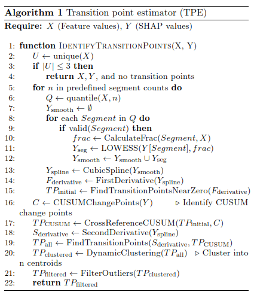

# Transition Point Estimator (TPE)

Transition point estimator is algorithm for identifying critical points (maxima, minma and saddle points) of an input or predictor varaible that indicate a significant impact in prediction of a target variable in a machine learning model.

## Citation

Abstract accepted in Alzheimer's Association International Conference (AAIC) for summer 2024. 
*https://alz.confex.com/alz/2024/meetingapp.cgi/Paper/90697*

Please use this reference to site the abstract when using TPE [*DOI will be available once published*]

## Backgroud

SHAP (SHapley Additive exPlanations) offer a way to quantify the impact of individual features on model predictions.The SHAP package provides several useful tools such as summary plots, decision plots, dependency plots, and cohort analysis. TPE is based on depenency plots which s*how the effect a single feature has on the predictions made by the model.* TPE is an analytical approach that can identify critical points (maxima, minma and saddle points) of a predictor feature that indicate a change in the prediction.

## Algorithm

Cumulative sum, LOWESS, and spline curve fitting are mainly used to identify critical points. First, we train a machine learning model with the feature of interest as an input, and then obtain the SHAP values. TPE then takes the feature and its SHAPs as inputs and will fit a curve between them, and calculate the first derivatives (slope) of the curve. Second, a CUSUM (Cumulative Sum) analysis identifies change points along the curve and cross-reference them where the slopes are steepest near the zero-crossing location of the curve. Z*ero SHAP* is an important indicator of a features progressive importance for model prediction because a feature's influence on prediction significantly shifts when its SHAP values go from positive to negative or vice versa. Third, second derivatives are calculated to identify inflection points (peaks and troughs) along the curve. Lastly, all the potential change points are compiled and post-processed.



## **How to run?**

Refer to the example notebook provided in this repo for a step-by-step application.

* TPE is contained in a single function, *find_transition_point(X, X_SHAP, hyperparameters)* , found in the python script named *transition_points.py*.
* The hyperparameters needed to run TPE are:
  * *slope_thresholds* : Defult [0.05]. Controls the slope at the zero-crossing.
  * *matching_thresholds* : Default [0.05]. Allows to get as close to the feature value as possible.
  * *peak_bottom_thresholds* : Default [0.8, 0.9]. Controls the second derivatives.
  * *significance_thresholds* : Default [0.001]. Controls the second derivatives.
  * *user_defined_s* : Default [0.07, 0.09, 1.10, 0.15, 0.2, 0.4]. Smoothing factors in UnivariateSpline
  * *user_defined_k* : Default [3]. Cubic spline

```
(   x_smoothed,
    y_sv_smoothed,
    x_spline_smooth,
    y_spline_smooth,
    transition_point_found,
    transition_points,
) = find_transition_point(
    x_features,
    y_shap_values,
    slope_thresholds,
    matching_thresholds,
    peak_bottom_thresholds,
    significance_thresholds,
    user_defined_s,
    user_defined_k,
    handle_duplicates="median",
)
```

The transition points are stored in the variable named ***transition_points***.

## Remarks for improvement

* TPE is an emperical method that needs domain knowledge to correctly interpret the results. Future versions will incorporate heuristic approaches.
* Outliers could affect its performance.
* It can be used for change point detection  with time series data but if the trend is harmonic it can be sensitive to the first possible point only since it was designed for a one point detection for SHAP related applications. Will be improved in future updates.

##### Version 0.0.0 - 06/07/2024
